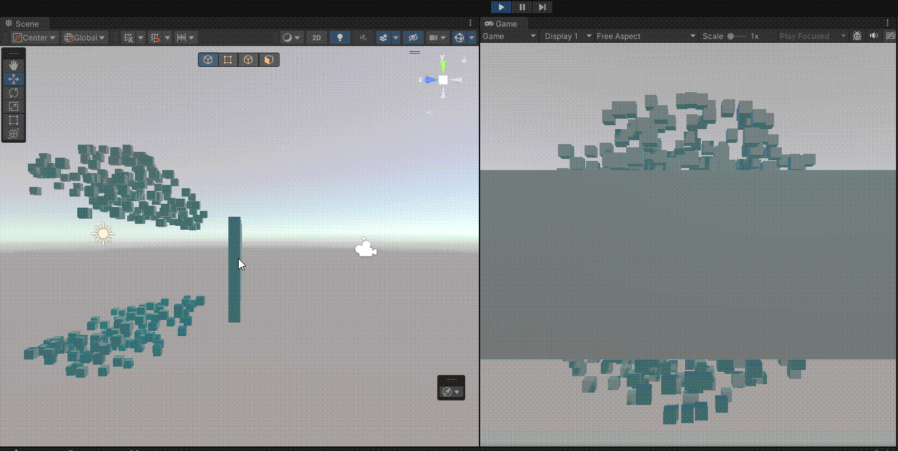
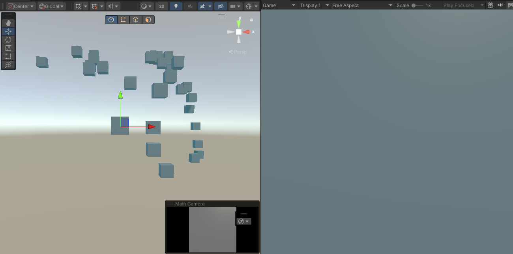

# HIZ-OC-algorithm-implements-in-URP-RF

### 基于 URP RenderFeature 实现 Hiz Occlusion Culling 算法

由于 Unity6 以下的版本没有集成 GPU 剔除功能，且可能需要根据项目需求自定义剔除策略，因此需要自定义实现该功能。通过 Unity 提供的 Render Feature 将 HIZ 剔除算法添加到 URP 渲染流程中。实现了实时的遮挡剔除。

### 算法流程

获取相机深度图-->计算每级mipmap贴图-->将每级mipmap贴图拷贝到一张贴图上-->GPU剔除

### 结果

#### 基础效果：



#### 待改进：

1. 直接获取了场景中所有的静态物体作为GPU剔除的输入，正常应该是做视椎体剔除后的物体。这里为了演示选择在GPU中做视椎体剔除：

```c++
if( ndcMax.x < 0 || ndcMax.y < 0 || ndcMin.x > 1 || ndcMin.y > 1 || ndcMax.z >1 || ndcMin.z<0)
{
    return half4(1, 0, 0, 1);
}
```
2. 不完全位于视椎体内的物体可能剔除不了，位于视椎体外的顶点会产生错误的采样结果（采样到别的级别的mipmap）从而导致剔除失败。



产生原因：

```c++
float2 ndcSize = floor((ndcMax.xy - ndcMin.xy) * _Mip0Size);
float raidus = max(ndcSize.x, ndcSize.y);
int mip = ceil(log2(raidus));
mip = clamp(mip, _MipmapLevelMinMaxIndex.x, _MipmapLevelMinMaxIndex.y);
float4 offsetAndSize = _MipOffsetAndSize[mip];
int4 pxMinMax = float4(ndcMin.xy,ndcMax.xy) * offsetAndSize.zwzw + offsetAndSize.xyxy;

// 点位于视椎体外从而采样到别的级别的mipmap的值
float d0 = LOAD_TEXTURE2D_LOD(_DepthPyramidTex, pxMinMax.xy,0); // lb
float d1 = LOAD_TEXTURE2D_LOD(_DepthPyramidTex, pxMinMax.zy,0); // rb
float d2 = LOAD_TEXTURE2D_LOD(_DepthPyramidTex, pxMinMax.xw,0); // lt
float d3 = LOAD_TEXTURE2D_LOD(_DepthPyramidTex, pxMinMax.zw,0); // rt
```

